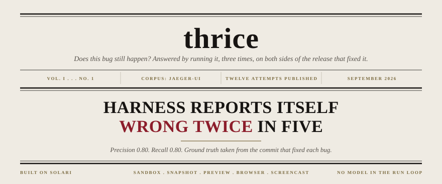
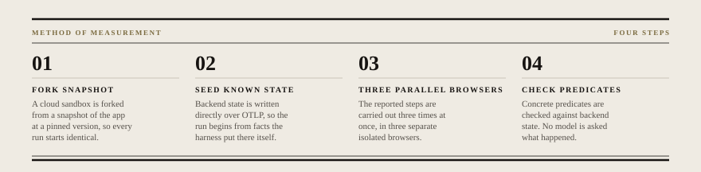
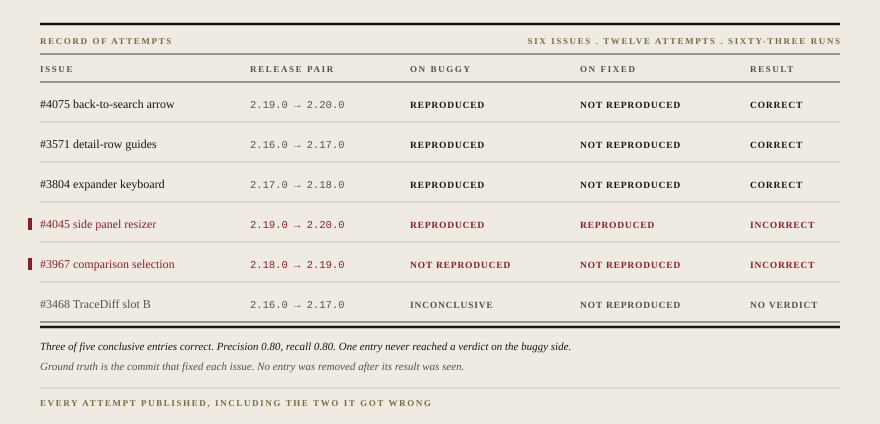

<p align="center">
  
</p>

**thrice** reproduces reported UI bugs in self-hosted open source web apps. It forks a cloud sandbox from a snapshot of the app at a pinned version, seeds known backend state, runs the reported steps three times in parallel cloud browsers, and checks concrete predicates against that state.

There is no model in the run loop. Plans are authored by a human, validated against a schema, and executed deterministically. The verdict comes from backend state, never from an agent's account of what it did.

---

## The result

It was validated against a corpus of already-fixed `jaeger-ui` issues, where the right answer is known from the commit that fixed each bug. Run on the last buggy release it should say REPRODUCED. Run on the first fixed release it should say NOT_REPRODUCED.

**Three of five conclusive entries correct. Precision 0.80, recall 0.80.**

It got two wrong. Both are published below with diagnoses, and both were caused by thrice, not by jaeger. No entry was removed from the corpus after its result was seen.

---

## Method

<p align="center">
  
</p>

A plan is a JSON document describing the reproduction: the seed payloads, the ordered steps, and two predicates. The **actual** predicate describes the buggy behaviour. The **expected** predicate describes correct behaviour. A run counts as reproduced only if the actual predicate holds and the expected predicate fails. Both are evaluated on every run.

Verdicts are `REPRODUCED` (3 of 3), `NOT_REPRODUCED` (0 of 3 with all steps completing), `FLAKY` (1 or 2 of 3), or `INCONCLUSIVE` (any run failed to complete, with a reason attached).

---

## Record of attempts

<p align="center">
  
</p>

Every attempt is published in [`artifacts/`](artifacts/), including the two that scored incorrect and the one that never reached a verdict. Each carries a self-contained report page with per-step timings, assertion screenshots, and a stitched screencast of each of the three runs.

---

## What it got wrong

**#4045, false positive.** The side panel resizer read as absent on both releases, even though the captured screenshot shows the correct state with the side panel open and the timeline hidden. The cause was in thrice: the predicate evaluator pinned `.first`, so `element_visible` and `element_absent` silently answered a different question on any page where several elements matched.

**#3967, false negative.** The two releases have materially different search interfaces. The view-mode pin that keeps a single plan valid across a release pair waits for a List/Table toggle that shipped in 2.19.0, so it cannot exist at 2.18.0. The mitigation for cross-version divergence turned out to be version-dependent itself.

**#3468, inconclusive.** The compare route renders identically on both versions, so the approach was wrong in kind rather than in degree. It is recorded as inconclusive rather than excluded.

---

## What is implemented

thrice is a validated vertical slice, not a complete implementation of its own specification.

| | Declared | Implemented |
|---|---|---|
| Plan actions | `goto` `click` `fill` `press` `select` `wait_for` `scroll` `assert` | `goto` `click` `wait_for` `assert` |
| Predicate types | 10 | 4 (`element_visible`, `element_absent`, `text_present`, `text_absent`) |

A plan using an unimplemented action or predicate is rejected by the validator before anything launches, with the message "specified but not implemented yet". It does not fail partway through a run. `assert` is accepted but is a no-op in the runner, so three of the eight declared actions actually do anything. Every corpus entry was authored within the implemented subset: across all twelve plans the actions used are `goto`, `wait_for` and `click`, and the predicates are `element_visible`, `element_absent` and `text_present`.

---

## The corpus and how it was bounded

Candidates were drawn from `jaeger-ui` issues closed between the 2.14.0 and 2.20.0 releases. Fixes were mapped to releases by resolving the `jaeger-ui` submodule commit pinned at each `jaeger` release tag and testing ancestry, rather than by comparing dates. That caught 2.15.0 and 2.15.1 shipping an identical UI commit, which makes that pair unusable.

Of 44 candidates, 6 qualified. The dominant exclusion was not expressiveness:

| Reason | Count |
|---|---|
| Release pair unavailable (fix after 2.20.0, no identifiable fix commit, or fixed before 2.14.0) | 22 |
| Not assertable from a small seed with a concrete predicate | 14 |
| Marginal, not promoted to reach a target number | 2 |
| **Qualified** | **6** |

The corpus is bounded by jaeger's seven-month 2.x release window, not by what thrice can assert.

Nine dark-mode and contrast regressions were deliberately excluded. A screenshot region digest could separate them mechanically, but between adjacent releases many things change, so the predicate would report "these pixels differ" rather than "this contrast bug is present." All nine would have scored correct for the wrong reason.

---

## What did not work

**63 runs across 21 attempts produced zero divergence and zero FLAKY verdicts.**

The three-run mechanism, which the project is named after, is unvalidated by this corpus. It cost three times the browser-seconds and bought no information on any entry. The mitigating point is that the corpus was selected for small deterministic seeds, which is close to selecting for non-flakiness, so this is weak evidence either way.

Validating it properly needs a corpus of deliberately nondeterministic cases with a controlled nondeterminism source. That was out of scope for a seven-day build. The divergence differ remains specified and unbuilt, because writing it would mean coding against zero examples.

Full evidence for this and nine other findings is in [`docs/findings.md`](docs/findings.md), including three that contradict the platform documentation.

---

## Running it

```bash
uv sync
cp .env.example .env          # SOLARI_API_KEY
uv run python -m thrice.attempt plans/4075-2.19.0.json plans/4075-2.20.0.json
uv run python -m thrice.report artifacts/<attempt-id>
```

There is no packaged CLI yet: the runner and reporter are module entry points.
The day-one environment gates were one-off spikes and live in
[`spikes/`](spikes/) with their results in [`spikes/GATES.md`](spikes/GATES.md).

An attempt costs roughly one cent. The whole validation run, six issues across twelve attempts, cost under twenty cents.

A budget guard refuses to start any run that would cross a per-attempt or daily ceiling, and a sandbox ledger records every sandbox at creation and sweeps orphans at exit, including after `SIGKILL`.

---

## Built on Solari

thrice uses [Solari](https://docs.getsolari.com) for sandboxes, snapshots, preview URLs, cloud browsers, and screencast capture. A runnable minimal example lives in the [cookbook fork](https://github.com/u7k4rs6/solari-cookbook/tree/main/examples/thrice-jaeger).

Three things that each cost a day and are not in the documentation:

- The not-ready preview status is **502**, not the documented 425, and is indistinguishable from a genuinely broken gateway. Poll with a hard deadline and corroborate from inside the sandbox.
- **Snapshot before you seed.** A fork carries the seeded state, so a snapshot built after seeding is not clean.
- **Verify the extracted binaries, not the tarball.** Jaeger's published `sha256sum.txt` covers the binaries inside the archive, not the archive itself.

---

## License

MIT.
