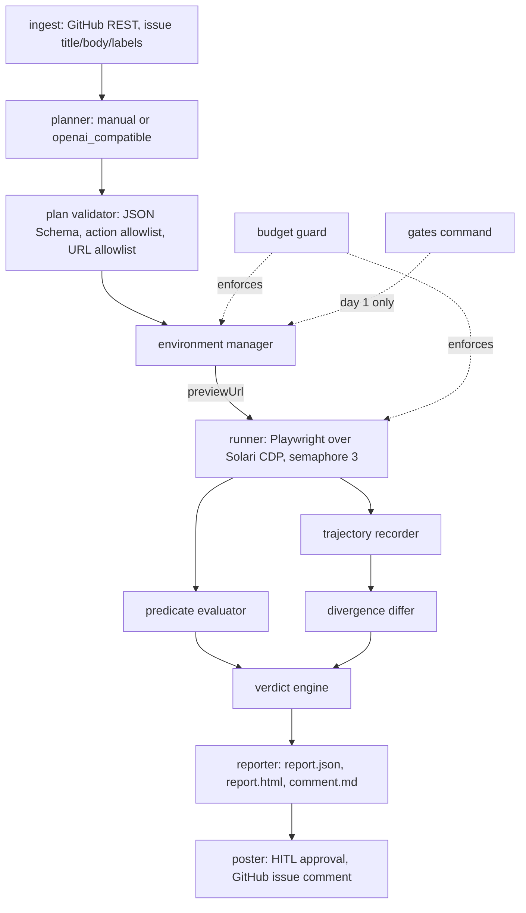

# thrice: architecture

Status: draft, day 1. Decisions D1 to D9 and gates G1 to G7 are numbered as in `01-prd.md`, whose section 0 records the two changes (C1 Starter plan, C2 no posting plus corpus validation) applied throughout.

## 1. Components



Ingest is read-only GitHub REST. The planner is offline (D3) and never runs during an attempt. The validator is the trust boundary between LLM output and anything that executes. The environment manager owns every sandbox call; the runner owns every browser call; nothing else touches Solari. The budget guard sits in front of both and can refuse. The gates command is the only thing that touches Solari on day 1.

**The poster and the approval flow are specified here and not built (C2).** They stay in the diagram, in the data model, and in `04-frontend-spec.md`'s CLI and comment templates, because the design is part of the deliverable and because v2 needs them intact. In v1 the pipeline terminates at the reporter, and the corpus scorer consumes report JSON directly. Nothing in thrice holds a GitHub write credential, which makes "nothing is posted" a property of the build rather than a promise about behaviour.

The **corpus scorer** is a new v1 component under C2: it reads the report JSON for the two attempts of each entry, applies the correctness rule from `01-prd.md` section 6, and emits per-entry outcomes plus aggregate correct, incorrect, and INCONCLUSIVE counts with precision and recall. It is a pure function over report files and spends no credits.

## 2. Sequence for one attempt

Rates from `01-prd.md` section 8 at **Starter** (C1): $0.00002778 per browser-second, $0.00001583 per sandbox-second at 1 vCPU / 2 GB. The sequence below is Model A (one shared sandbox); Model B forks one sandbox per run in two waves and is described in section 4.

> *Defect record, C1.* Previously: "$0.00004167 per browser-second, $0.00002375 per sandbox-second", the free-tier rates.

| # | Step | Solari call | Cost |
|---|---|---|---|
| 1 | Load and validate the plan | none | 0 |
| 2 | Budget guard: reserve the attempt ceiling ($0.10) against the day ledger, refuse if it would cross | none | 0 |
| 3 | Acquire the sandbox semaphore (1) | none | 0 |
| 4 | Fork the prepared environment | `SandboxClient.create(template=..., from_snapshot=<snap>, cpu=1, mem_mb=2048, timeout_ms=900000, lifecycle={"onTimeout":"kill"})` with an `Idempotency-Key` | sandbox clock starts |
| 5 | Connect the control channel | `Sandbox.connect()` (websocket to `/control/:id`) | 0 |
| 6 | Health check Jaeger | `commands.run("sh", args=["-c", "curl -fsS localhost:16686/ ..."])`, poll to 60 s | sandbox seconds |
| 7 | Seed backend state (D2) | `files.write` the OTLP JSON payloads, then `commands.run` curl to `localhost:4318/v1/traces`, assert HTTP 200 per seed | sandbox seconds |
| 8 | Verify the seed landed | `commands.run` curl to `localhost:16686/api/traces?...`, compare to the seed's `expected_response` | sandbox seconds |
| 9 | Get the public URL | `Sandbox.preview_url(16686)` returns `{"url", "token"}`, signed with a one-hour `pt_token` | 0 |
| 10 | Poll the preview from outside | plain HTTPS GET; `425 Too Early` means nothing is listening yet, poll until 200 | 0 |
| 11 | Acquire the browser semaphore (3) and launch three | `browser.launch(recording=True, stealth=False, proxy=None)` x3 | 3 browser clocks start |
| 12 | Run each plan in its own browser | `chromium.connect_over_cdp(session.cdpEndpoint)`, one context per run | browser seconds |
| 13 | Evaluate both predicates per run (D4) | none, all local against captured state | 0 |
| 14 | Release browsers | `DELETE /sessions/:id` per session | browser clocks stop |
| 15 | Capture video (G3) | screencast frames already collected, or `sessions.download_replay(id)` | 0 |
| 16 | Kill the sandbox | `Sandbox.kill()`, `DELETE /sandboxes/:id`, idempotent | sandbox clock stops |
| 17 | Diff, verdict, report | none | 0 |
| 18 | Settle the ledger: replace the reservation with actual seconds | none | 0 |

Expected totals: about 180 sandbox-seconds and 360 browser-seconds, **$0.0129** at Starter (Model A), or **$0.0181** for Model B.

> *Defect record, C1.* Previously: "$0.0193", at free-tier rates.

## 3. Data model

### Plan

| Field | Type | Notes |
|---|---|---|
| `plan_version` | int | Schema version, currently 1 |
| `issue` | object | `{repo, number, url, title_sha256}`; issue text is never stored verbatim in a report |
| `app` | object | `{name:"jaeger", version:"2.20.0", tarball_sha256, ui_port:16686, otlp_port:4318}` |
| `seeds` | Seed[] | 0 to 8, applied in order |
| `steps` | Step[] | 1 to 40 |
| `expected_predicate` | Predicate | The correct behaviour. Must FAIL for a reproduction |
| `actual_predicate` | Predicate | The reported buggy behaviour. Must HOLD for a reproduction |
| `assertion_step_ids` | string[] | Steps where a screenshot and region digest are captured |
| `notes` | string | Free text from the planner, never executed |

```json
{
  "plan_version": 1,
  "issue": {"repo": "jaegertracing/jaeger-ui", "number": 0, "url": "https://github.com/...", "title_sha256": "..."},
  "app": {"name": "jaeger", "version": "2.20.0", "tarball_sha256": "c967368b...", "ui_port": 16686, "otlp_port": 4318},
  "seeds": [{"id": "s1", "endpoint": "/v1/traces", "payload": {}, "expected_response": {"status": 200}}],
  "steps": [{"id": "st1", "action": "goto", "locators": [], "args": {"path": "/trace/<id>"}, "timeout_ms": 15000}],
  "expected_predicate": {"type": "count_equals", "args": {"selector": "[data-testid=span-row]", "value": 2}},
  "actual_predicate": {"type": "element_visible", "args": {"role": "alert", "name_re": "^Invalid trace"}},
  "assertion_step_ids": ["st3"]
}
```

### Step

| Field | Type | Notes |
|---|---|---|
| `id` | string | Stable across runs; the differ aligns on this (D6) |
| `action` | enum | `goto`, `click`, `fill`, `press`, `select`, `wait_for`, `scroll`, `assert` |
| `locators` | Locator[] | Ordered fallbacks. First that resolves wins; all missing is `locator_miss` |
| `args` | object | Action-specific, schema-constrained |
| `timeout_ms` | int | 1000 to 30000 |

A Locator is `{by: "role"|"text"|"label"|"testid"|"css", value, name_re?, nth?}`. No XPath and no JavaScript may come from a plan (D3, and `03-security-and-access.md` section 3).

### Predicate (D4)

| Type | Args | Evaluated against |
|---|---|---|
| `element_visible` | locator | Live DOM |
| `element_absent` | locator | Live DOM |
| `text_present` | `{re, scope?}` | Text content of scope or body |
| `text_absent` | `{re, scope?}` | Same |
| `url_matches` | `{re}` | `page.url` |
| `console_error` | `{re}` | Captured console entries, level error |
| `network_response` | `{url_re, status}` | Captured responses |
| `attribute_equals` | `{locator, attr, value}` | Live DOM |
| `count_equals` | `{locator, value}` | Live DOM |
| `screenshot_region_digest_equals` | `{locator, digest}` | Optional, PNG of the clipped region |

### Seed

| Field | Type | Notes |
|---|---|---|
| `id` | string | |
| `endpoint` | string | `/v1/traces` only in v1 |
| `payload` | object | OTLP/HTTP JSON, size-capped (`03-security-and-access.md` section 3) |
| `expected_response` | object | `{status: 200}`; a mismatch is `seed_failure`, which is INCONCLUSIVE |

### TrajectoryEvent (D6)

| Field | Type |
|---|---|
| `step_id` | string |
| `seq` | int |
| `action` | string |
| `locator_used` | object or null |
| `locator_index` | int, which fallback resolved |
| `t_start_ms`, `t_end_ms` | int, relative to run start |
| `screenshot_sha256` | string or null |
| `assertion_region_digest` | string or null |
| `console` | `[{level, text_sha256}]` |
| `network` | `{count, statuses: {..}, errors: int}` |
| `outcome` | `ok`, `locator_miss`, `timeout`, `error` |

### RunResult, Verdict, BudgetLedger

| RunResult field | Type |
|---|---|
| `run_index` | 0, 1, 2 |
| `session_id` | string, redacted in reports |
| `events` | TrajectoryEvent[] |
| `expected_predicate_held` | bool or null |
| `actual_predicate_held` | bool or null |
| `reproduced` | bool or null; true only when actual holds and expected fails (D4) |
| `completed` | bool |
| `incomplete_reason` | enum or null |
| `browser_seconds` | float |
| `video_path` | string or null |

Verdict is `{attempt_id, verdict, runs_reproduced, runs_total, first_divergence, reason, app_version, cost_usd}`. BudgetLedger is an append-only JSONL of `{ts, attempt_id, kind: "reserve"|"settle", browser_seconds, sandbox_seconds, usd}` with a derived daily total.

## 4. Environment manager

**G6, answered by reading the shipped source of solari-sandbox 0.2.0 and its dependency solari-core 0.2.0, not by inferring parity from the TypeScript docs.** The wheels were downloaded from PyPI and read directly. All five named surfaces are present in Python, and the docs' claim that "TypeScript and Python are at full parity" holds for this subset.

| TS surface | Python | Where | Underlying REST |
|---|---|---|---|
| `previewUrl(port)` | **present**, renamed `preview_url(port)` | `solari_core.handle.SessionHandle` | `GET /sandboxes/:id/ports/:port` returning `{"url", "token"}` |
| `snapshot(name)` | **present**, same name | `SessionHandle.snapshot` | `POST /sandboxes/:id/snapshots` returning `{"snapshotId"}` |
| `fromSnapshot` | **present**, renamed `from_snapshot=` | `SandboxClient.create` | `POST /sandboxes` body key `fromSnapshot` |
| `pause` / `resume` | **present**, same names | `SessionHandle` | `POST /sandboxes/:id/pause`, `POST /sandboxes/:id/resume` |
| `kill` | **present**, same name | `SessionHandle.kill` and `SandboxClient.kill(id)` | `DELETE /sandboxes/:id`, documented idempotent |

Also present and useful: `revert(snapshot_id)` (`POST /sandboxes/:id/revert`), `set_timeout`, `metrics`, `list`/`list_all` with metadata filters, `commands.run/start/pty`, `files.*`, `git.*`, `run_code`. No raw HTTP fallback is required for anything thrice needs, so G4 is satisfied by the SDK. The client is constructed as `SandboxClient(api_key=..., base_url="https://api.getsolari.com")`.

**Snapshot build (D1), run once per Jaeger version.** Create a 1 vCPU / 2 GB sandbox, `commands.run` a curl of `https://github.com/jaegertracing/jaeger/releases/download/v2.20.0/jaeger-2.20.0-linux-amd64.tar.gz` (58,367,331 bytes), extract, verify, start `./jaeger` with in-memory storage, health check 16686 and 4318, then `snapshot("jaeger-2.20.0-ready")` and kill.

One correction to D1's stated procedure, found while verifying the release: the published `jaeger-2.20.0-linux-amd64.sha256sum.txt` contains checksums of the two **extracted binaries**, not of the tarball. Its content is two lines, for `jaeger-2.20.0-linux-amd64/example-hotrod` and `jaeger-2.20.0-linux-amd64/jaeger`. So verification is extract-then-verify against the published file, and separately thrice pins its own SHA-256 of the tarball, computed locally as `c967368ba09be356089ef7e8aab2a76d170dc007ff6ccf7925c8167ede2900d7`, so that a silently replaced asset is caught before extraction. The tarball ships exactly those two files, confirming both the `jaeger` binary and `example-hotrod`.

**Per-attempt fork.** `create(from_snapshot=<snap>, cpu=1, mem_mb=2048, timeout_ms=900000, lifecycle={"onTimeout": "kill"}, metadata={"thrice_attempt": attempt_id})`. `onTimeout: kill` rather than `pause`, because a paused sandbox does not count against the concurrent limit but does keep state thrice does not want, and the attempt is the unit of cleanup. The metadata key makes orphan sweeping possible via `list(metadata={"thrice_attempt": ...})`.

**Health checks.** Two, in order: inside the sandbox, `curl -fsS localhost:16686/` and a POST of an empty OTLP batch to `localhost:4318/v1/traces`; and outside, an HTTPS GET of the preview URL, where `425 Too Early` is the documented "nothing listening yet" signal and is polled rather than treated as failure. Only 16686 is exposed via previewUrl (D2); 4318 stays internal, which keeps seeding deterministic and avoids a second public surface.

**Execution models.** Under C1 there are two, and the choice is per plan rather than forced by the platform.

**Model A, shared instance.** Three browsers against one sandbox, in parallel. Sound only when the UI is a read-only view over seeded data, which jaeger-ui is. Cheapest and fastest, and the default for jaeger-ui.

**Model B, fork-per-run.** One sandbox per run. Starter allows **2** concurrent sandboxes, not 3, so three runs execute as two waves (two runs, then one) rather than three in parallel. This is worth stating plainly because "Starter unlocks fork-per-run" is true in the sense that matters (runs share no backend state) and false in the sense one might assume (they are still not all simultaneous). Costs 40% more per attempt and roughly doubles wall clock; see `01-prd.md` section 8.

**Read-only UI is now a target property, not a constraint.** It is still recorded in the plan as `app.read_only_ui: true`, and it is still what makes Model A valid, so the validator refuses **Model A** without it. It no longer gates thrice's ability to run a target at all: a stateful target selects Model B and runs. A third option remains for the pathological case, sequential runs with `revert(snapshot_id)` between them, which rewinds the same sandbox and keeps its id, so the preview host is stable and only the `pt_token` must be refreshed.

> *Defect record, C1.* Previously: "Three browsers share one sandbox instance, which is only sound because jaeger-ui is a read-only view over seeded data ... This is a **target requirement** ... and the validator refuses parallel execution without it ... or fork-per-run, which needs 3 concurrent sandboxes and therefore a paid plan. Neither is implemented in v1." Fork-per-run is now available, at 2-way concurrency rather than 3.

**previewUrl handling.** The base URL comes from `preview_url(16686)`. The config switch `env.mode: sandbox | external` remains in the schema, because an externally hosted target is a reasonable v2 shape, but there is no VPS fallback in v1: if G1 fails, day 1 stops and the design is reconsidered rather than routed around.

**Multi-version snapshots (C2, gate G7).** The corpus needs one snapshot per Jaeger version, named `jaeger-<version>-ready`, built by the same procedure and differing only in the pinned tarball URL and digest. Snapshots are addressed by id and recorded in `versions.json` alongside the tarball digest and the build time, so a corpus entry names two snapshot ids and nothing else. G7 tests that two versions can coexist as separate snapshots and that a fork from each is healthy; if older 2.x releases have different asset names or archive layout, that surfaces on day 1.

> *Defect record, C1.* Deleted: the G1 fallback description, "In `external` mode it is a static base URL for a Jaeger hosted on a free VPS ... which is what makes the fallback a config switch rather than a rewrite."''

## 5. Runner

One `chromium.connect_over_cdp(session.cdpEndpoint)` per run, one browser context per run, no context reuse across runs. The three runs are independent by construction: separate Solari sessions, separate contexts, separate cookie jars.

Navigation is always relative to the base URL from section 4, and the plan supplies only a path. A plan cannot name a host.

Locator strategy: role, then text, then label, then testid, then CSS, in the order the plan lists them. The first that resolves within the step timeout is used and its index is recorded in the trajectory, because "run 2 needed the third fallback" is itself a signal. No XPath, and no JavaScript, may come from a plan. If every fallback misses, the run ends immediately with `locator_miss` and the attempt is INCONCLUSIVE (D3: no LLM repair in v1).

At each `assertion_step_ids` step: a full-page screenshot (hashed, stored) and a digest of the clipped assertion region. Console entries and network responses are captured for the whole run via CDP `Runtime` and `Network` domains and summarised rather than stored verbatim.

Per-run timeout is 10 minutes, well inside the 1 hour session cap. Cleanup runs in a `finally` on every path: close the context, release the session, and record actual browser-seconds even when the run raised.

## 6. Divergence differ

Runs are aligned by `step_id`, never by sequence index, because a run that took a different locator fallback still visits the same steps. For each step id present in more than one run, the differ compares, in order: `outcome`, then predicate outcome if that step is an assertion step, then `assertion_region_digest`. The first step id where any of those differ is the first divergence.

Output is `{step_id, key, values: {run_0, run_1, run_2}, preceding_step_id}`. Timing is deliberately not a comparison key (see Q14): two runs that differ only in milliseconds are not divergent. No full DOM diff in v1 (D6).

## 7. Budget guard

Ceilings from `01-prd.md` section 8 at Starter: **$0.10 per attempt** (unchanged as a round number, though the underlying Model B ceiling fell from $0.0964 to $0.0927), and a daily ceiling of **$2.00**, a tenth of the $20.00 monthly allocation. The guard reserves the attempt ceiling before any Solari call, refuses to start if the reservation would cross the daily ceiling, and settles against actual seconds afterwards. Reserve-then-settle rather than measure-as-you-go, because a crash between calls must not leave the ledger optimistic.

The ledger is append-only JSONL under `~/.thrice/ledger.jsonl`, keyed by UTC date.

**Concurrency (D7, revised under C1).** A local semaphore of **2 sandboxes and 3 browsers**, acquired before the API call, never after.

- The sandbox semaphore of 2 is the Starter plan's hard cap, so it is a platform limit and must not be raised.
- The browser semaphore of 3 is **self-imposed**, not a platform limit. Starter allows 20. Three is the number of runs in one attempt, and since the sandbox cap of 2 already serialises attempts, more browsers would buy nothing. This is the significant shift under C1: browsers have stopped being the scarce resource and sandboxes have become it.

> *Defect record, C1.* Previously: "a local semaphore of 3 browsers and 1 sandbox", where 3 browsers was the free-tier hard cap and 1 sandbox likewise. Both numbers were platform limits; now only the sandbox number is.

A 429 `ConcurrencyLimitExceeded` therefore still means the semaphore is wrong, so it is logged as a harness bug, aborts the attempt as INCONCLUSIVE, and is **never retried** (D7). The docs are explicit that no SDK retries a 429 and that a tight retry loop burns quota against a wall. The 429 body carries `plan` and `cap`, both recorded. A 503 `ConcurrencyCheckUnavailable` is a different animal and is retried with jittered backoff.

Session length is no longer close to binding: Starter allows 5 hours against the 10 minute per-run timeout. Stealth is available on Starter and stays off, because thrice drives only pages it serves itself and stealth would spend credits for nothing.

Every create route sends `Idempotency-Key: <uuid-v4>`. The gateway remembers the first 2xx per (org, key) for 24 hours and replays it byte for byte with `Idempotent-Replayed: true`; without a key, a retried create can double-charge. Reusing a key with a different body returns 409 `IdempotencyKeyReused`.

## 8. Video path (G3), ranked

Reordered on day 1, then corrected by measurement. **All three options work.** The ranking is therefore on merit rather than on feasibility, which is not what was expected going in.

**1. CDP `Page.startScreencast`, frames stitched locally with ffmpeg.** Measured: 45 PNG frames over 4.5 s, 516 KB, all landing on the laptop, stitched to a 46 KB MP4 with ffmpeg 8.0.1 at exit 0. First place, and the reason is now positive rather than defensive: thrice needs individually addressable frames anyway. D6 requires a screenshot hash and an assertion-region digest per step, so screencast makes one mechanism serve both the trajectory and the video, and it gives full control of format, quality and dimensions while riding the CDP session the run already holds.

**2. Playwright `record_video` on a context created over CDP.** Measured: **it works.** `new_context(record_video_dir=...)` was accepted on a `connect_over_cdp` browser, `page.video` was populated, `video.path()` resolved, `save_as()` wrote 41,612 bytes locally, and ffprobe confirms a valid VP8 webm, 640x480, 134 packets, 5.36 s, whose extracted frames show the remote page's animation (3 distinct colours on frame 2 rising to 432 by frame 40). Second place only because the artifact is opaque: one webm for the whole context lifetime, with no per-step addressability, so it would have to run alongside screenshot capture rather than instead of it.

Why it works, since the expectation was that it would not: Playwright's **driver runs locally** when you `connect_over_cdp`, and Chromium video recording is implemented in that driver by consuming screencast frames and muxing them. The bytes therefore never live on the browser host at all. Option 2 is, mechanically, option 1 with Playwright doing the frame collection and muxing.

> *Defect record, corrected by measurement on day 1.* The day-1 instruction was to demote `record_video` to third on two grounds: that `record_video_dir` is a `new_context()` option while `connect_over_cdp` returns an unconfigurable existing context, and that even with a fresh context Playwright writes the `.webm` on the browser host with no file-transfer channel to retrieve it. The first is half right: the **existing** context cannot be reconfigured (confirmed, `record_video` is not a settable attribute on it), but `new_context()` on a CDP-connected browser is accepted and does record. The second is wrong for `connect_over_cdp`, for the driver-locality reason above. Both were tested rather than assumed; see `spikes/GATES.md` G3. No claim is made here about a standing upstream feature request, because none was verified.

**3. Solari session replay.** Measured: retrievable, and quickly. One 404 then success at 4.6 s after release, returning 1,923 bytes of rrweb NDJSON across 8 lines, first line `{"type":4,"data":{"href":...}}`, and **not** a video container. Excellent evidence and the cheapest to obtain, but it cannot be dropped into a static report page as a `<video>` without shipping a player, which conflicts with the no-framework rule in `04-frontend-spec.md` section 3. Third for that reason alone. Under C1 retention is 7 days rather than 1, so the download-immediately rule is prudence rather than necessity. A first poll returning 404 is normal: the upload is asynchronous and completes after the session is released.

> *Note on an earlier reading.* A first G3 pass polled 10 times at 3 s and saw 404 throughout, which would have ranked replay as unavailable. Re-tested with a longer window and a page that generated real DOM events, it resolved in under 5 s. The 30 s failure is not reproducible and was not treated as a result.

Whichever wins, the file lands at `artifacts/<attempt_id>/run_<n>.<ext>` and the path goes into RunResult. thrice uses option 1 and keeps option 3 as a second, independent record.

## 9. Failure handling and idempotency

Every attempt writes `artifacts/<attempt_id>/state.json` after each phase transition: `planned`, `sandbox_up`, `seeded`, `preview_ready`, `runs_done`, `scored`, `reported`, `posted`. `thrice run` on an existing attempt id resumes from the last completed phase rather than restarting, which matters because the expensive phase (fork plus seed) is the one most likely to be interrupted.

| Failure | Handling |
|---|---|
| Partial runs (1 or 2 of 3 completed) | The attempt is INCONCLUSIVE, not FLAKY. FLAKY requires three completed runs with a split result (D5) |
| 429 | Never retried. Attempt aborts INCONCLUSIVE with reason `concurrency_cap`, guard bug logged |
| Sandbox death mid-run | Runs fail with `timeout` or network errors, attempt is INCONCLUSIVE, `kill` is still called (it is idempotent) |
| Preview 401 | Token expired or altered. Fetch a fresh `preview_url`; if it fails twice, INCONCLUSIVE with `preview_unavailable` |
| Preview 425 | Not a failure. Poll until 200 or the health timeout |
| GitHub token expired | Only affects ingest and posting. The verdict and report still exist locally; `thrice post` is re-runnable |
| Orphaned sandbox | `thrice gates --sweep` lists by `metadata.thrice_attempt` and kills anything older than an hour |

## 10. Configuration and secrets

`.env` only, never committed, never written into a sandbox. `SOLARI_API_KEY`, `GITHUB_TOKEN`, and optionally `LLM_API_KEY` plus `LLM_BASE_URL`. Non-secret configuration lives in `thrice.toml`: `env.mode`, budget ceilings, timeouts, and the pinned app versions. Full treatment in `03-security-and-access.md` sections 1 and 3, including why the preview URL and its `pt_token` are themselves secrets.

## 11. Local footprint

No local Chrome, ever. The only browsers are Solari's, reached over CDP, which is a deliberate constraint given about 11 GiB of laptop RAM with VS Code and Claude Code already resident. No local Docker. Python 3.11 or newer inside a uv-managed venv, because system Python 3.14 is externally managed; everything runs under `uv run`. Steady-state local memory is a Python process, an asyncio loop, three websocket connections, and screencast frames streamed to disk rather than buffered.

## 12. Testing strategy

Unit tests run against recorded fixtures and spend **zero credits**: captured CDP frames for the runner, captured HTTP responses for the sandbox and GitHub clients, and hand-written plan JSON for the validator. This is what makes development survive a Solari outage (`01-prd.md` section 10).

The predicate evaluator, the differ, the verdict engine, and the budget guard are pure functions over recorded data and are the most heavily tested parts, because they are what the verdict actually rests on.

One live smoke test, gated behind `THRICE_LIVE=1`, does a single fork, seed, one browser run, and kill. It is never run in CI. The `gates` command is the only thing that touches Solari on day 1.

## 13. Proposed module layout (later, not now)

`thrice/cli.py`, `thrice/ingest.py`, `thrice/plan/{schema.py,validate.py,manual.py,openai_compatible.py}`, `thrice/env/{manager.py,snapshot.py,seed.py,health.py}`, `thrice/run/{runner.py,locators.py,capture.py,video.py}`, `thrice/score/{predicates.py,diff.py,verdict.py}`, `thrice/report/{json.py,html.py,comment.py}`, `thrice/corpus/{entries.py,score.py}`, `thrice/post/github.py` (specified, unbuilt under C2), `thrice/budget/{guard.py,ledger.py}`, `thrice/gates.py`.

## 14. Open questions and [UNVERIFIED] items

Open questions Q1 to Q16 are listed in `01-prd.md` section 11. The ones that land hardest here are Q4, Q5 and Q11 (section 4), Q6 (section 8), Q14 (section 6), and Q16 (Model A or Model B as the corpus default, section 4).

1. **Resolved on day 1, opposite to expectation.** Playwright `record_video` over `connect_over_cdp` **does** work and the file lands locally, because Playwright's driver is local and does the muxing (section 8). Measured in `spikes/GATES.md` G3. Q9 closed.
2. [UNVERIFIED] Fork time for `create(from_snapshot=...)`. G2 measures it; the 180 sandbox-second estimate in section 2 assumes roughly 20 s.
3. [UNVERIFIED] Whether a preview domain is configured for this org at all, which the docs list as a precondition for previewUrl. G1 and Q4. Resolved on day 1; see `spikes/GATES.md`.
4. [UNVERIFIED] Snapshot count and retention limits on Starter. Not on the pricing page, and load-bearing under C2, which needs 10 to 12 live snapshots. Q11.
5. [UNVERIFIED] Whether Jaeger's in-memory store is empty and healthy immediately after a fork, or whether the snapshot captures a warm store that needs clearing before seeding. G2 and Q5.
6. [UNVERIFIED] Sandbox egress to github.com. G5 and Q7.
